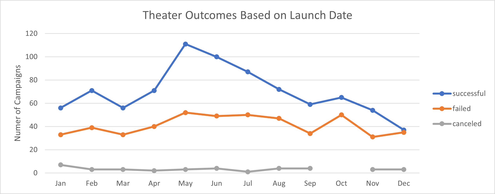
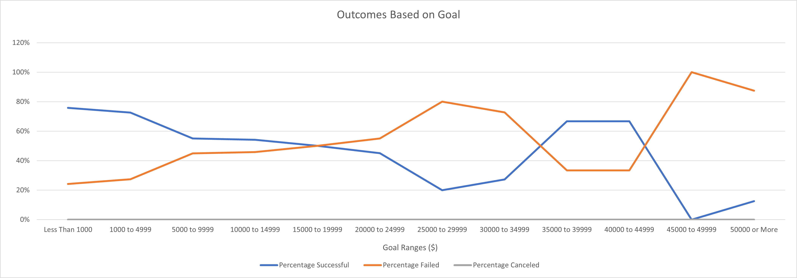

# Kickstarting with Excel

## Overview of Project
Louise is an up-and-coming playwright who is hoping to get some crowdfunding for her play titled *Fever*. She has estimated that her play will require a budget of $10,000 and has made that her funding goal. This project will use data from Kickstarter and Excel to analyze previous campagins. 

### Purpose
The Purpose of this project is to analyze data from previous Kickstarter campaigns to find any trends that will help Louise find out what criteria she needs to have for her campaign to have the best chance at success.  

## Analysis and Challenges

### Analysis of Outcomes Based on Launch Date 

The date of the launch for the campaigns was converted from unix to readable dates. Then using a pivot table, a line graph was used to show the outcomes of campaigns launched over the course of a year. This helped us see if there is any trend linked to the time of the year when a campaign was launched. The outcomes were classified into successful, failed and canceled, to give a better understanding of the effect on time of the year on the occurences that a campaign launched would succeed.

### Analysis of Outcomes Based on Goals

The goals of all the campaigns was counted into bins of $5000, to see how the campaign goal affects the outcomes. 

### Challenges and Difficulties Encountered

## Results

- What are two conclusions you can draw about the Outcomes based on Launch Date?
1. The most successful theater campaigns were launched in May, and the least successful were launched in December. 
2. Between May to September, there is a steady drop in the number of successful kickstarters
Based on these results, it would be best for Louise to launch her kicstarter in May.

- What can you conclude about the Outcomes based on Goals?
1. 50% or more of campaigns with a goal between $0 to $20,000 are successful 
2. 50% or more of campaigns with a goal of between $20,000  to $35,000 failed 
3. There are fewwer campaigns in total with a goal of $25,000 or more, and this causes a skew in the data. 
Based on these results, Louise'sbudget of $10,000 is reasonable and likely to be successful. 

- What are some limitations of this dataset?
Any outliers are not accounted for, and this may skew the results. 

- What are some other possible tables and/or graphs that we could create? 
It would be interesting to see if the genre of the plays have an effect on success, as well as the length of time of the campaign, using the deadline column. 
